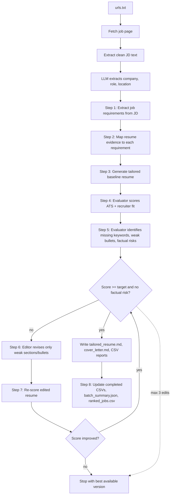

# Job Application Batch Analyzer

LLM-driven local pipeline for resume tailoring and application artifact generation.

The goal is not to hardcode keywords for one JD. The pipeline uses LLM extraction, evidence mapping, evaluation, and constrained editing so it can generalize across companies and roles while staying truthful to the candidate's __REAL__ resume evidence.

## What it does

For each job URL from `urls.txt`, the pipeline will:

1. Fetch and extract job description text.
2. Extract structured job requirements from the JD.
3. Map resume evidence to each requirement.
4. Generate a tailored baseline resume.
5. Score ATS + recruiter fit with an Evaluator prompt.
6. If needed, use an Editor prompt to revise only weak sections/bullets, then re-score.
7. Generate LLM outputs:
   - `tailored_resume.md`
   - `cover_letter.md`
   - `ats_<score>_gap_diagnosis.md` (if below target)
   - `interview_prep.md` only when `--interview-prep` is enabled
8. Write per-job CSV reports plus run-level `batch_summary.json`, `ranked_jobs.csv`, and completed reports. Reports are updated after each processed job, so progress is preserved if a run is interrupted.

The batch pipeline uses a CV-understanding cache (`cv_deep_understanding.md`) to improve wording refinement and JD-term replacement without fabricating experience.

## Pipeline flow



The first resume is a full baseline rewrite. After that, retries use **Evaluator + Editor separation**: the Evaluator scores and diagnoses only, while the Editor revises only the weak sections or bullets identified by the Evaluator. The loop stops when the score reaches `TARGET_RESUME_SCORE` and the Evaluator reports no factual risk, or after 3 local edit attempts.
If the baseline rewrite does not improve over the original resume, the original resume is kept. If a local edit does not improve over the previous tailored version, the edited version is rejected, the previous higher-scoring resume is kept, and the loop stops.

## Design principles

- **Generalized ATS simulation**: the Evaluator scores semantic fit, recruiter fit, evidence strength, factual risk, and ATS readability instead of relying on a fixed keyword list.
- **Truth-constrained generation**: JD terminology is used only when it is supported by the original resume, CV-understanding cache, or mapped resume evidence.
- **Evaluator/Editor separation**: the Evaluator diagnoses only; the Editor revises only the weak sections or weak bullets identified by the Evaluator.
- **Local iteration after baseline**: the first tailored resume can be a full rewrite. Later attempts are local edits to the already-polished resume, not repeated full regeneration.
- **Keep the best version**: if one optimization step does not improve the score, that new version is rejected, the previous higher-scoring resume is kept, and the pipeline stops.
- **Human-readable reports**: large per-job analysis artifacts are written as CSV files instead of long JSON files.

## Inputs

Use `data/` as your local input directory:

```text
data/
  resume.pdf                  # default resume path, not committed
  resume.docx                 # also supported
  resume.txt                  # also supported
  resume.md                   # also supported
  urls.txt                    # one job URL per line, not committed
  cv_deep_understanding.md    # generated cache, not committed
```

Your resume can be `.pdf`, `.docx`, `.txt`, or `.md`. The default Makefile commands use `data/resume.pdf`; if you use another file, pass `RESUME=...`, for example `make run RESUME=data/resume.txt`. `data/cv_deep_understanding.md` is generated from your resume and reused by the batch pipeline. It should stay local because it contains detailed resume analysis.

`data/` is reserved for your actual local input files. These files are ignored by git and should not be committed.

## Repository structure

```text
job-application-optimizer/
  README.md
  LICENSE
  .gitignore
  .env.example
  pyproject.toml
  requirements.txt
  Makefile
  data/
    .gitkeep
  outputs/
    .gitkeep
  src/
    job_application_optimizer/
      cli.py
      config.py
      models.py
      llm/
      resume/
      jobs/
      scoring/
      generation/
      io/
      pipeline/
  scripts/
```

The implementation lives under `src/job_application_optimizer/`. There are no root-level legacy Python scripts; use the package CLI or `python -m` entrypoints.

## Setup

```bash
python3 -m venv .venv
source .venv/bin/activate
pip install -r requirements.txt
pip install -e .
make install-browser
cp .env.example .env
```

Environment variables (loaded from `.env`):

- `LLM_API_KEY` (required)
- `LLM_MODEL` (required)
- `LLM_BASE_URL` (optional; leave blank for OpenAI, or set an OpenAI-compatible gateway URL)
- `LLM_API_MODE` (optional, default `responses`; use `chat` for OpenAI-compatible chat-completions endpoints such as many local/open model servers)
- `LLM_REASONING_MODEL` (optional; overrides the model used for requirements extraction, evidence mapping, ATS scoring, and gap diagnosis)
- `LLM_WRITER_MODEL` (optional; overrides the model used for resume, cover-letter, and local editor generation)
- `LLM_INTERVIEW_MODEL` (optional; overrides the model used for interview-prep generation)
- `LLM_CV_MODEL` (optional; overrides the model used for CV deep-understanding generation)
- `LLM_METADATA_MODEL` (optional; overrides the model used for job metadata extraction)
- `LLM_<ROLE>_BASE_URL`, `LLM_<ROLE>_API_KEY`, `LLM_<ROLE>_API_MODE` (optional; route a role to a different OpenAI-compatible endpoint without changing business code)
- `TARGET_RESUME_SCORE` (optional, default `80`)
- `PROMPT_CHAR_LIMIT` (optional, default `0` = no truncation; set positive value to cap each large text block per prompt)
- `JOB_FETCH_MODE` (optional, default `browser`; use `browser`, `auto`, or `requests`)
- `JOB_FETCH_MIN_TEXT_CHARS` (optional, default `800`; below this, `auto` tries browser rendering)
- `JOB_FETCH_BROWSER_TIMEOUT_MS` (optional, default `30000`)
- `JOB_FETCH_BROWSER_WAIT_MS` (optional, default `1500`; extra wait after page load for JS-rendered content)
- `JOB_FETCH_BROWSER_HEADLESS` (optional, default `true`)
- `REWRITE_LIFT_THRESHOLD` (optional, default `3`; minimum estimated score lift required before generating a tailored rewrite)

## Model Routing

The pipeline keeps model/provider choices inside `src/job_application_optimizer/llm/`. Business stages request a role such as `reasoning`, `writer`, `interview`, `cv`, or `metadata`; they do not bind to DeepSeek, Qwen, NVIDIA NIM, vLLM, SGLang, or any other model family.

By default, every role falls back to `LLM_MODEL` through `LLM_API_KEY` / `LLM_BASE_URL`. You can selectively route judgment-heavy stages to a stronger thinking model while keeping generation on a faster writer model:

```env
LLM_API_KEY=...
LLM_MODEL=gpt-4o-mini
LLM_API_MODE=responses

LLM_REASONING_MODEL=your-reasoning-model
LLM_REASONING_BASE_URL=https://your-openai-compatible-endpoint/v1
LLM_REASONING_API_KEY=...
LLM_REASONING_API_MODE=chat

LLM_WRITER_MODEL=gpt-4o-mini
```

If all roles use the same compatible gateway, set `LLM_BASE_URL` and `LLM_API_MODE=chat` when that gateway supports chat completions rather than the Responses API.

## Job Fetching

The fetcher uses Playwright headless Chromium by default so JavaScript-rendered job descriptions are captured after the page loads. If you need a faster non-browser path, set `JOB_FETCH_MODE=auto` or `JOB_FETCH_MODE=requests`.

Fetch modes:

```env
JOB_FETCH_MODE=browser   # default: Playwright for every JD URL
JOB_FETCH_MODE=auto      # requests first, browser fallback when needed
JOB_FETCH_MODE=requests  # fastest, no browser rendering
```

Install the browser binary once after installing dependencies:

```bash
make install-browser
# equivalent: python -m playwright install chromium
```

Use `JOB_FETCH_BROWSER_HEADLESS=false` if you want to watch the browser while debugging difficult pages.

## Resume Optimization Flow

The optimizer first scores the original resume against the JD, identifies ATS gaps, classifies those gaps using the resume evidence map, and estimates whether a rewrite can realistically improve the score. It generates a tailored `version1` only when the estimated lift meets `REWRITE_LIFT_THRESHOLD`.

Gap classes:

- Supported by resume evidence: can rewrite with stronger JD-aligned wording.
- Partially supported: can soften or reframe without overclaiming.
- Adjacent only: can use transferable positioning, not direct claims.
- Not supported: cannot add to the resume.

Acceptance is score-first: a generated or edited resume is accepted only if its score improves over the current accepted resume and ATS readability does not regress. Factual risks are still reported in the CSVs and edit log, but they are advisory signals rather than automatic rejection gates.

## Commands

### 1. Put your input files in `data/`

```text
data/resume.pdf      # or data/resume.docx, data/resume.txt, data/resume.md
data/urls.txt
```

Supported resume formats: `.pdf`, `.docx`, `.txt`, `.md`. The default commands use `data/resume.pdf`; pass `RESUME=...` when using another file.

`data/urls.txt` format:

```text
https://example.com/job-1
https://example.com/job-2
# comments are allowed
```

### 2. Generate CV understanding

```bash
PYTHONPATH=src python -m job_application_optimizer.resume.understanding \
  data/resume.pdf \
  -o data/cv_deep_understanding.md
```

Or:

```bash
make cv-understanding
make cv-understanding RESUME=data/resume.txt
```

### 3. Run batch optimization

```bash
PYTHONPATH=src python -m job_application_optimizer.cli \
  --urls data/urls.txt \
  --resume data/resume.pdf \
  --cv-understanding data/cv_deep_understanding.md \
  --out outputs \
  --completed-csv completed_job.csv \
  --completed-all-csv completed_jobs_all.csv
```

Or:

```bash
make run
make run RESUME=data/resume.txt
```

After `pip install -e .`, you can also use the console commands:

```bash
generate-cv-understanding data/resume.pdf -o data/cv_deep_understanding.md

job-application-optimizer \
  --urls data/urls.txt \
  --resume data/resume.pdf \
  --cv-understanding data/cv_deep_understanding.md \
  --out outputs
```

Interview preparation packs are optional and disabled by default. Add `--interview-prep` when you want per-job interview coaching output.

### Run Logs

Each batch or standalone interview-prep run writes a timestamped debug log under `logs/`:

```text
logs/batch_YYYY-MM-DD_HH-MM-SS.log
logs/interview_prep_YYYY-MM-DD_HH-MM-SS.log
```

Log lines include a real timestamp, job index, job id, URL, stage name, output paths, scores, and stage duration. `logs/` and `*.log` are ignored by git.

### Terminal Progress

Batch runs print the total number of JDs before processing, then print a start line for each job with exact time, index, id, and URL, followed by one completion row per job:

```text
date | id | company | job | ats_scores | screening_recommendation | status | time
```

ATS scores at or above `TARGET_RESUME_SCORE` are shown in green; scores below target are shown in red. The footer prints total processing time.

Standalone interview-prep backfill prints the total number of folders to process and one row per folder:

```text
date | id | company | job | status | time
```

Interview prep generated inside the main batch with `--interview-prep` does not print a separate interview-prep table.


## Interview Prep Backfill

There are two ways to generate interview prep:

1. During a full batch run with `--interview-prep`.
2. After a batch run, by backfilling `interview_prep.md` into existing output folders.

Use backfill when you already have `tailored_resume.md` and `job_text.txt` and do not want to rerun JD fetching, ATS scoring, resume generation, or cover letter generation.

Generate interview prep for one job folder:

```bash
make interview JOB_FOLDER=outputs/YYYY-MM-DD/Company_Role
# alias: make run-interview JOB_FOLDER=outputs/YYYY-MM-DD/Company_Role
```

Equivalent command:

```bash
PYTHONPATH=src python -m job_application_optimizer.generation.interview_prep \
  --job-folder outputs/YYYY-MM-DD/Company_Role \
  --cv-understanding data/cv_deep_understanding.md
```

Generate interview prep for every job folder in one run directory:

```bash
make interview-all RUN_DIR=outputs/YYYY-MM-DD
# alias: make run-interview-all RUN_DIR=outputs/YYYY-MM-DD
```

Equivalent command:

```bash
PYTHONPATH=src python -m job_application_optimizer.generation.interview_prep \
  --run-dir outputs/YYYY-MM-DD \
  --cv-understanding data/cv_deep_understanding.md
```

By default, existing `interview_prep.md` files are skipped. Use `OVERWRITE=1` with Makefile commands, or `--overwrite` with the direct Python command, when you intentionally want to regenerate them.

```bash
make run-interview JOB_FOLDER=outputs/YYYY-MM-DD/Company_Role OVERWRITE=1
make run-interview-all RUN_DIR=outputs/YYYY-MM-DD OVERWRITE=1

PYTHONPATH=src python -m job_application_optimizer.generation.interview_prep \
  --job-folder outputs/YYYY-MM-DD/Company_Role \
  --cv-understanding data/cv_deep_understanding.md \
  --overwrite

OVERWRITE=1 JOB_FOLDER=outputs/YYYY-MM-DD/Company_Role scripts/generate_interview_prep.sh
OVERWRITE=1 RUN_DIR=outputs/YYYY-MM-DD scripts/generate_interview_prep.sh
```

Backfill requires these files in each job folder:

```text
job_text.txt
tailored_resume.md
```

It also reads:

```text
data/cv_deep_understanding.md
```

## Output structure

```text
outputs/
  YYYY-MM-DD/
    batch_summary.json
    ranked_jobs.csv
    Company_Role/
      job_text.txt
      requirements_evidence_matrix.csv
      evaluation_history.csv
      analysis_summary.csv
      resume_edit_log.md
      tailored_resume.md
      cover_letter.md
      interview_prep.md              # only with --interview-prep
      ats_<score>_gap_diagnosis.md
completed_job_YYYY-MM-DD.csv
completed_jobs_all.csv
```

## Report files

- `completed_job_YYYY-MM-DD.csv`: one file per run date.
- `completed_jobs_all.csv`: cumulative report in append mode across runs.
- `requirements_evidence_matrix.csv`: merged human-readable view of JD requirements, ATS keywords, resume evidence coverage, missing evidence, factual risk, and recommended resume actions.
- `evaluation_history.csv`: versioned scoring history (`version1`, `version2`, etc.) with score deltas, weak sections, missing keywords, editor instructions, and stop reason.
- `resume_edit_log.md`: human-readable optimization log showing the original resume baseline drawbacks, accepted final version, editor attempts, score deltas, rejection/rollback reasons, and diffs for local edits.
- `analysis_summary.csv`: one-row per-job summary with original/optimized score, target result, top gaps, ATS-pass benchmarks, coverage counts, and overall screening recommendation. It intentionally avoids duplicating the full requirement matrix or every evaluation detail.
- The two completed-job reports include a `run_date` column.
- Completed-job reports include `gap_type`, `gap_summary`, and `screening_recommendation` from the LLM ATS simulation.
- Completed-job reports are flushed after every job, not just at the end of the run.
- Structured list/dict fields in per-job CSV reports are formatted as multi-line bullet cells instead of compact JSON or `|`-separated strings. Enable text wrapping in your spreadsheet viewer for best readability.

## How to read the CSV reports

Start with `analysis_summary.csv` to decide whether the job is worth applying to. It shows the original score, optimized score, target result, stop reason, top gaps, and coverage counts.

Use `top_ats_pass_benchmarks` to understand what a high-scoring resume would likely prove to pass ATS/recruiter screening for the role. These benchmarks are tied to JD-priority weak points where possible, with coverage, gap size, rewrite potential, and whether the gap requires real new experience. They are screening benchmarks, not facts the optimizer is allowed to add to your resume unless the source resume already supports them.

Use `requirements_evidence_matrix.csv` when you want to understand why a score is low. The most important columns are:

- `priority_rank`: inferred requirement priority. The script first uses LLM-extracted screening priorities when they can be matched, then falls back to `importance` and JD order.
- `importance`: whether the JD requirement is must-have, important, or nice-to-have.
- `coverage`: whether your resume evidence is strong, partial, adjacent, or missing.
- `resume_evidence`: the concrete resume-backed proof available for that requirement.
- `missing_evidence`: the real gap that should not be fabricated.
- `safe_resume_terms`: JD-aligned wording that can be used truthfully.
- `recommended_action`: whether to feature, strengthen, reposition, or avoid claiming the requirement.

Use `evaluation_history.csv` when you want to inspect the optimization loop. `version1` is the baseline tailored resume. Later versions are local Editor revisions. `score_delta`, `improved`, and `stop_reason` show whether each attempt helped and whether a lower-scoring version was rejected. `analysis_summary.csv` includes `accepted_resume_version`, which tells you whether final `tailored_resume.md` corresponds to `version1`, a later version, or `original`.

Use `resume_edit_log.md` when you want the readable narrative of what happened: which version was accepted, which editor attempts were accepted or rejected, and what changed in each local edit.

## Limitations

This tool does not guarantee an interview, recruiter response, or offer. ATS behavior and recruiter decisions vary by company, role, applicant pool, timing, referrals, internal candidates, and many factors outside the resume.

Its value is clarity: it helps identify which parts of the JD are already well supported by your resume, which requirements are only partially covered, which gaps are real and should not be fabricated, and which wording can be safely improved. In other words, it should make your advantages and missing evidence easier to see before you apply.

## Notes

- No job page screenshot export is performed.
- Resume optimization remains truth-constrained (no fabricated experience).
- `interview_prep.md` is optional; use `--interview-prep` only when you need it.
- `ranked_jobs.csv` is sorted by `meets_target` first, then `optimized_score`.
- Prompt text blocks (JD/resume/CV understanding) are full-length by default; use `PROMPT_CHAR_LIMIT` only if you need to reduce prompt size for cost or context-window stability.
- If `--out outputs` is used, artifacts are written under `outputs/YYYY-MM-DD/`.

## License

This project is licensed under the MIT License. See [LICENSE](LICENSE).
